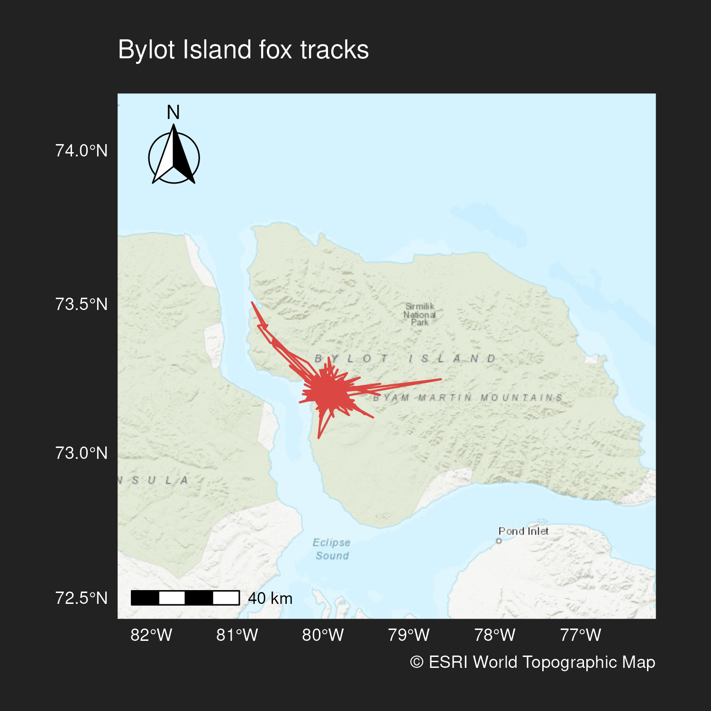
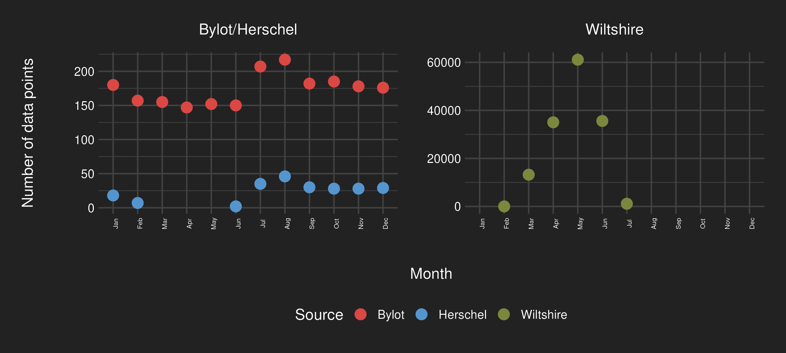
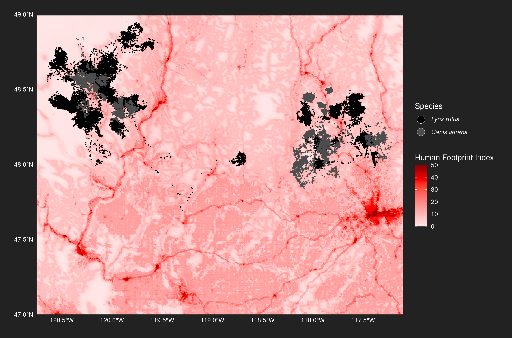
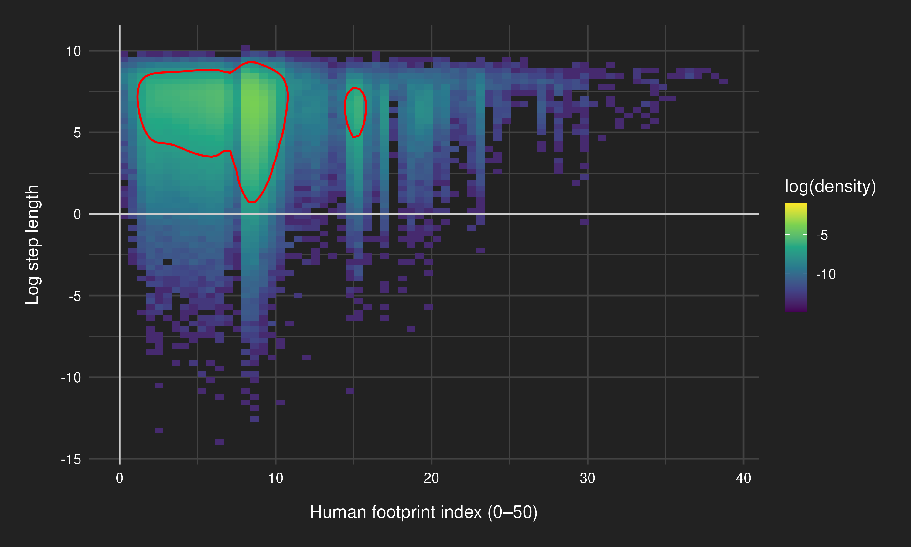
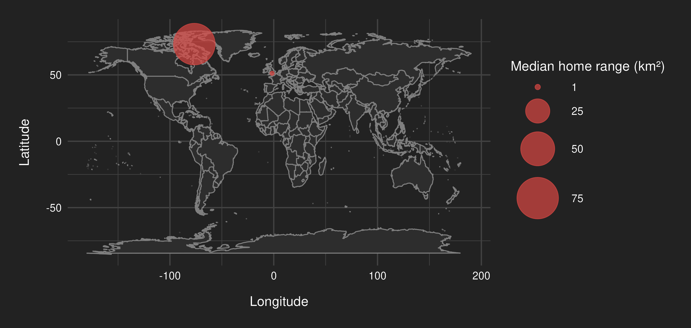
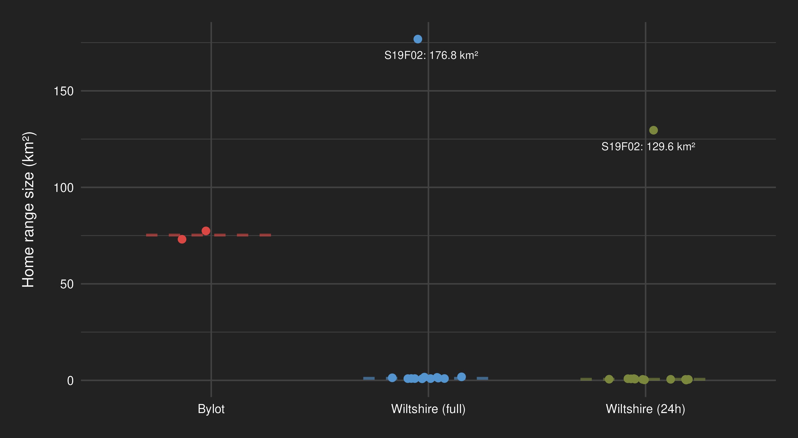
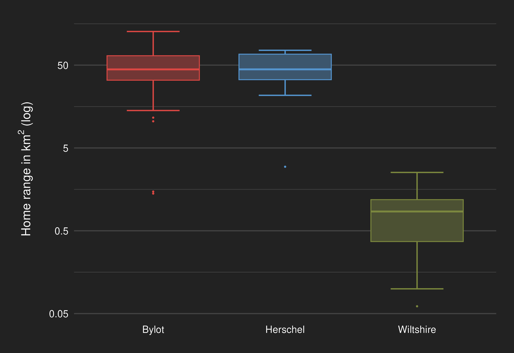
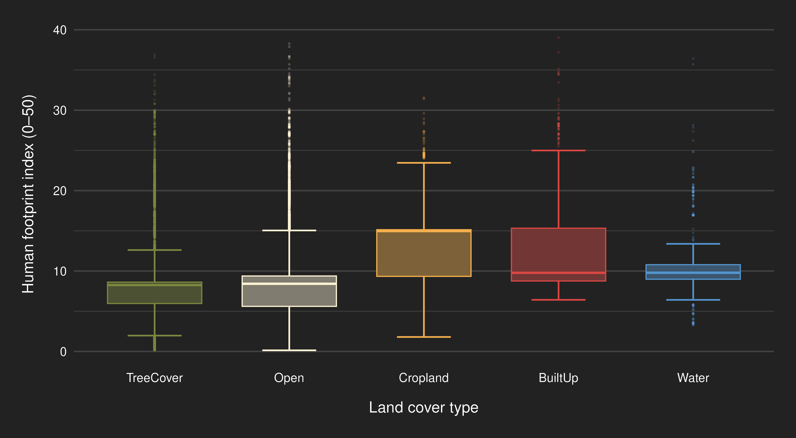

---
author:
- Jannis Bolzern and Elke Michlmayr
authors:
- Jannis Bolzern and Elke Michlmayr
bibliography: bibliography.bib
execute:
  message: false
  warning: false
lang: en
subtitle: An analysis of selected datasets from the Movebank animal
  tracking database
title: How does human activity affect the movement patterns of wild
  animals?
toc-title: Table of contents
---

# Abstract

We investigate how human activity affects the movement patterns of wild
animals by analyzing GPS tracking data of red foxes and coyotes from
rural and remote areas in England, Canada, and the U.S. We compare home
range sizes and model habitat selection in relation to human footprint
and land cover, using spatial analysis and step selection functions. Our
results show that foxes maintain substantially smaller home ranges in
human-impacted areas. Coyotes preferentially selected forested and open
habitats at low to moderate human footprint, while avoiding highly
developed landscapes as human disturbance increased.

# Introduction

Human disturbance has been shown to broadly affect animal movement, as
demonstrated by a large-scale meta-analysis @doherty2021human. This
study addresses two related research questions:

1.  **Home range size implications**: Do animals exhibit smaller home
    ranges in areas with higher human impact?

    This is addressed by comparing red fox (*Vulpes vulpes*) home ranges
    across landscapes with varying levels of human footprint.

2.  **Habitat selection in human-influenced landscapes**: How do animals
    select habitats under different degrees of human presence?

    This is analyzed using coyote (*Canis latrans*) and initially also
    bobcat (*Lynx rufus*) tracking data from northeastern Washington.

Together, these analyses aim to evaluate both large-scale home range
adjustments and fine-scale habitat preferences in response to human
activity.

# Data and methods

## Datasets

We analyzed four animal tracking datasets obtained from the Movebank
database @kays2022movebank, including red fox (*Vulpes vulpes*) tracks
from Wiltshire, UK @porteus2024movement, Bylot Island, Canada, and
Herschel Island, Canada @lai2022red, as well as bobcat (*Lynx rufus*)
and coyote (*Canis latrans*) tracks from northeastern Washington, USA
@prugh2023fear. The tracking data varied in temporal resolution and
geographic context, with sample sizes and data characteristics
summarized in [Table 1](#tbl-datasets){.quarto-xref}.

  --------------------------------------------------------------------------------
  Dataset      Species   Years        Individuals   Sampling interval   Total
                                                                        fixes
  ------------ --------- ------------ ------------- ------------------- ----------
  Wiltshire    Red fox   2016--2019   35            10--60 min          146072

  Bylot        Red fox   2011--2015   2             1/day (afternoon)   2086

  Herschel     Red fox   2009--2010   2             1/day (afternoon)   223

  Washington   Coyote    2014--2015   34            4-hour programmed   72893

  Washington   Bobcat    2014--2015   36            4-hour programmed   48813
  --------------------------------------------------------------------------------

In addition to movement data, we used global covariate datasets: the
2020 global terrestrial Human Footprint Index (HFP-100) at 100 m
resolution [@gassert2023operational], and the ESA WorldCover 2021 land
cover dataset at 10 m resolution [@zanaga2022esa].

Detailed descriptions of data preprocessing, filtering, and acquisition
procedures are provided in the [supplementary material](#sec-sup-mat).

## Exploratory data assessment

### Red fox {#sec-redfoxdata}

Data from Wiltshire ([Figure 1](#fig-wiltshire-map){.quarto-xref}) were
collected between 2016 to 2019 during the UK wader nesting season,
defined as March 15th to June 15th, for a total of 35 foxes. Locations
were recorded every 10 to 60 minutes, with the sampling rate remotely
reduced during periods deemed less informative to conserve battery.

{.lightbox width="100%"}

{.lightbox ref-parent="fig-tracks"}

{.lightbox ref-parent="fig-tracks"}

Data from Bylot and Herschel ([Figure 2](#fig-tracks){.quarto-xref})
were collected year-round, at a lower sampling rate of once per day at
random afternoon times. Data collection spanned 2009--2010 for Herschel
and 2011--2015 for Bylot, with two foxes monitored per island. [Figure 3
(a)](#fig-datapoints-year){.quarto-xref} shows annual data availability,
highlighting the much larger dataset from Wiltshire due to more animals
and higher sampling frequency. [Figure 3
(b)](#fig-datapoints-month){.quarto-xref} reveals seasonal variation in
data availability at the monthly scale.

{.lightbox width="100%"
ref-parent="fig-data-points"}

{.lightbox width="100%"
ref-parent="fig-data-points"}

### Bobcat and coyote

Coyote and bobcat GPS were collected in northeastern Washington between
2014 and 2015, with collars programmed to record locations every four
hours. The two species occupied two distinct geographic areas with
overlapping but species-specific home ranges
[Figure 4](#fig-esa){.quarto-xref}, shown in relation to land cover
data. Human footprint was generally low across the study area, except
for localized settlements and roads [Figure 5](#fig-hfp){.quarto-xref}.

{.lightbox width="100%"}

{.lightbox width="100%"}

Although collars were programmed for regular sampling, actual intervals
were irregular, with substantial variation, especially among bobcats.
Sampling interval distributions are shown in
[Figure 6](#fig-sampling-rates){.quarto-xref}.

{.lightbox
ref-parent="fig-sampling-rates"}

{.lightbox
ref-parent="fig-sampling-rates"}

## Analytical methods {#sec-methodology}

We applied two analytical approaches: (1) home range estimation for red
foxes and (2) habitat selection modeling using step-selection functions
for coyotes.

### Home range size assessment

We estimated home range sizes using minimum convex polygons (MCP),
providing standardized, comparable measures of space use across
individuals. However, differences in temporal scale between the datasets
posed challenges for comparability. The Wiltshire data were sampled at
10--60 minute intervals, while the Bylot and Herschel datasets were
sampled once daily. Additionally, data coverage varied across seasons
and years, and sample sizes differed substantially.

These discrepancies introduce potential biases in home range estimation
@laube2011. To mitigate these effects, we employed three strategies:

1.  We limited analyses to the same seasonal period (March 15th -- June
    15th) across datasets to control for seasonal variation. Due to
    limited data from Herschel Island for that timeframe ([Figure 3
    (b)](#fig-datapoints-month){.quarto-xref}), we focused comparative
    analyses on the Wiltshire and Bylot datasets.

2.  We generated a downsampled Wiltshire dataset by selecting a random
    daily location per individual, matching the lower sampling frequency
    of the Arctic datasets.

3.  We computed monthly home ranges for all datasets to explore temporal
    variation.

### Habitat selection modeling

To model fine-scale habitat preferences, we used step-selection
functions (SSFs) @fortin2005wolves. These compare environmental
attributes at "used" locations to those at randomly sampled "available"
locations along the animal's movement path. This allows to quantify how
animals respond to environmental covariates, such as human footprint and
land cover. Selection patterns are then compared to assess how habitat
preferences vary with human influence.

#### Step Generation and Covariates {#sec-step-cov}

Coyote and bobcat GPS tracks were irregularly spaced
([Figure 6](#fig-sampling-rates){.quarto-xref}) and were resampled for
temporal consistency --- coyotes to 4-hour intervals and bobcats to
8-hour intervals, both with a 10-minute tolerance --- using the
`amt::track_resample` function @signer2019animal. Steps were then
generated using the `amt::steps_by_burst` and `amt::random_steps`
functions. For each used step, ten random available steps were generated
based on empirical step length (gamma distribution) and turning angle
(Von Mises distribution). Log-transformed step lengths were calculated
for modeling to account for potential bias in the availability
distribution.

Each observed step and its corresponding random steps were grouped into
strata using a unique `step_id_`, following a matched case-control
design @prugh2023fear. Habitat covariates (land cover and human
footprint) were extracted for each step endpoint.

Land cover was reclassified into five ecologically meaningful categories
to improve interpretability and model convergence
([Table 2](#tbl-landcover-reclass){.quarto-xref}). Human footprint index
(HFP) values were standardized across the dataset for modeling.

  --------------------------------------------------------------------------
  **New       **Description**             **Used original classes**
  class**                                 
  ----------- --------------------------- ----------------------------------
  TreeCover   Tree-dominated areas (\>10% Tree Cover
              cover)                      

  Open        Open natural or             Grassland, Bare/sparse vegetation,
              low-intensity land use      Moss & lichen

  Cropland    Intensive agricultural      Cropland
              areas                       

  BuiltUp     Developed areas with        Built-up
              infrastructure              

  Water       Aquatic & semi-aquatic      Permanent water bodies, Herbaceous
              environments                wetland
  --------------------------------------------------------------------------

Refer to the [ESA WorldCover user
manual](https://worldcover2021.esa.int/data/docs/WorldCover_PUM_V2.0.pdf)
for detailed original class definitions.

To assess the distribution of human footprint across land cover types,
we visualized the HFP values at used locations using a ridgeline density
plot ([Figure 7](#fig-coy-eda-ridge){.quarto-xref}). The figure shows
that TreeCover was generally associated with lower human footprint,
while BuiltUp and Cropland had higher HFP values, supporting the
relevance of the interaction terms in our model. As a complementary
visualization, we include a boxplot in the Appendix showing the spread
of human footprint values across land cover types
([Figure 14](#fig-coy-eda-box){.quarto-xref}).

{.lightbox width="100%"}

To explore the relationship between movement behavior and human
disturbance, we visualized the joint distribution of the Human Footprint
Index (HFP) and log-transformed step length using a hexbin density plot
([Figure 8](#fig-coy-eda-hex){.quarto-xref}). Most steps occurred under
conditions of low human footprint and were characterized by short to
moderate movement distances. By including log-transformed step length as
a covariate, the model accounts for underlying variation in movement
intensity that could otherwise confound habitat selection estimates.

{.lightbox width="100%"}

#### Statistical model

Step selection functions (SSFs) are commonly modeled using conditional
logistic regression, which compares observed and available steps within
matched strata (e.g., `survival::clogit`; @manly2007resource). However,
for datasets involving multiple individuals, this approach can be
limiting in terms of flexibility. Since conditional logistic regression
is likelihood-equivalent to a Poisson regression model with
stratum-specific fixed intercepts, these can be treated as random
effects with a large fixed variance @muff2020accounting. By treating
these intercepts as random effects with a large fixed variance, the
model can be reformulated as a generalized linear mixed-effects model
(GLMM), allowing for the inclusion of random slopes to account for
individual variation in habitat selection.

Following this framework, we modeled habitat selection in relation to
human impact using a Poisson GLMM with a log link (implemented via
`glmmTMB::glmmTMB`; @brooks2017glmmTMB). Stratum-specific intercepts
(one per `step_id_`) were modeled as random effects with a fixed, large
variance to approximate the conditional logistic structure, enabling the
inclusion of individual-level random slopes and better capturing
heterogeneity in selection behavior.

The fixed effects included a two-way interaction between land cover
class and both the linear and quadratic terms of standardized human
footprint, as well as the natural logarithm of step length to control
for movement bias. Human footprint index (HFP) values were standardized
before modeling.

The model can be expressed as:

$$
\log(\lambda_{ij}) =
\beta_1 \cdot \text{LC}_{ij} +
\beta_2 \cdot \text{HFP}_{ij} +
\beta_3 \cdot \text{HFP}_{ij}^2 +
\beta_4 \cdot \ln(\text{SL}_{ij}) +
b_{0,step(i,j)} +
u_{i}
$$

where:

-   $\lambda_{ij}$ is the expected relative selection strength for step
    $j$ of individual $i$,\
-   $\text{LC}_{ij}$ is the land cover class,\
-   $\text{HFP}_{ij}$ is the standardized human footprint value,
-   $\text{SL}_{ij}$ is the step length,
-   $b_{0,\text{step}(i,j)}$ is a random intercept for each stratum
    (`step_id_`),\
-   $u_i$ represents individual-level random slopes.

Interaction terms between land cover and human footprint (both linear
and quadratic) were also included but are omitted here for clarity.

Following model fitting, we used average marginal effects and relative
selection strength (RSS) to visualize how habitat selection varied
across the human footprint gradient @avgar2017relative. These metrics
were computed from the fitted model to provide an interpretable measure
of selection intensity.

#### Bobcat data exclusion

We initially attempted SSF modeling for bobcats, but excluded them from
the final analysis due to insufficient sample sizes across land cover
types and irregular sampling intervals. These issues led to poor model
convergence and biologically implausible estimates. Only two land cover
classes remained after filtering, limiting ecological interpretability.
As a result, SSF analysis was conducted only for coyotes.

# Results

## Fox home ranges

Fox home ranges during the time period corresponding to the UK wader
nesting season are visualized as proportional circles in
[Figure 9](#fig-home-ranges-map){.quarto-xref}, providing a comparative
overview of median range sizes across Bylot and Wiltshire. Individual
home range areas are further summarized in
[Figure 10](#fig-home-range-sizes){.quarto-xref}, where each point
represents one animal's estimated range size. The median home range in
Bylot (75.3 km²) was over 65 times larger than in Wiltshire (1.1 km²).
When subsampling the Wiltshire data to a 24-hour interval, the median
home range decreased to 0.56 km².

{.lightbox width="100%"}

{.lightbox width="100%"}

Similar differences in order of magnitude between remote and rural fox
home ranges can also be observed for the monthly home range results
([Figure 11](#fig-home-ranges-boxplot){.quarto-xref}). Outliers are
removed, in particular the irregular data for Herschel Island ([Figure 2
(b)](#fig-herschel-map){.quarto-xref}).

{.lightbox width="100%"}

## Coyote habitat selection

The final step selection function (SSF) model included 666,248 steps
from 29 coyotes. The model converged successfully and revealed
significant effects of human footprint and land cover interactions on
habitat selection.

Coyotes exhibited significant variation in habitat selection across land
cover types and along the human footprint gradient
([Table 3](#tbl-emtrends){.quarto-xref}). Linear selection trends were
significantly positive in TreeCover ($\beta_1$ = +0.263, *p* = 0.0001)
and Open ($\beta_1$ = +0.139, *p* = 0.042), indicating increased
selection with increasing HFP at low to moderate levels. However,
significant negative quadratic trends in these habitats (TreeCover:
$\beta_2$ = -0.183, *p* \< 0.0001; Open: $\beta_2$ = -0.181, *p* \<
0.0001) suggested that selection peaked at intermediate HFP and declined
at higher human footprint levels.

Selection for Cropland and BuiltUp was weak and non-significant (*p* \>
0.05). Water showed a significant negative linear trend ($\beta_1$ =
-0.550, *p* = 0.036), indicating declining selection with increasing
HFP.

  ------------------------------------------------------------------------------
  Land cover   Linear trend ($\beta_1$)   SE        95% CI        *z*     *p*
  ------------ ------------------------ ------- --------------- ------- --------
  TreeCover             +0.263           0.068  0.130 -- 0.397   3.87    0.0001

  Open                  +0.139           0.068  0.005 -- 0.273   2.04    0.0420

  Cropland              -0.063           0.113  -0.283 -- 0.158  -0.56   0.5770

  BuiltUp               -0.062           0.309  -0.667 -- 0.544  -0.20   0.8420

  Water                 -0.550           0.263     -1.065 --     -2.09   0.0360
                                                    -0.035              
  ------------------------------------------------------------------------------

  -------------------------------------------------------------------------------
  Land cover       Quadratic trend        SE        95% CI        *z*      *p*
                     ($\beta_2$)                                        
  ------------ ------------------------ ------- --------------- ------- ---------
  TreeCover             -0.183           0.039     -0.260 --     -4.68   \<.0001
                                                    -0.106              

  Open                  -0.181           0.039     -0.257 --     -4.62   \<.0001
                                                    -0.104              

  Cropland              -0.153           0.046     -0.243 --     -3.35   0.0008
                                                    -0.064              

  BuiltUp               -0.161           0.077     -0.312 --     -2.11   0.0351
                                                    -0.011              

  Water                 -0.013           0.081  -0.172 -- 0.146  -0.16   0.8700
  -------------------------------------------------------------------------------

The average marginal effect plot
([Figure 12](#fig-avg-eff){.quarto-xref}) shows highest relative
selection for TreeCover and Open habitats at low to moderate human
footprint, with declining selection under increased human footprint.
BuiltUp, Cropland, and Water habitats were consistently selected less,
regardless of human footprint level.

{.lightbox width="100%"}

Relative selection strength (RSS) curves
([Figure 13](#fig-rss){.quarto-xref}) confirmed that coyotes preferred
TreeCover and Open habitats under low human footprint conditions, with
selection declining or leveling off at higher human disturbance.

{.lightbox width="100%"}

## Model validation

### Fox home ranges

To validate the home range estimation, we evaluated the influence of
coordinate system choice and data properties on the results.
Specifically, we compared median home range sizes calculated using
minimum convex polygons (MCP) across three coordinate systems: WGS84
(EPSG:4326), NAD83 (EPSG:3347), and UTM Zone 17N (EPSG:2958), identified
using the CRS Explorer. The differences in median home range area were
small (75.3 km² for WGS84, 73.3 km² for NAD83, and 75.8 km² for UTM Zone
17N), suggesting minimal distortion effects. Our validation criterion
required that any coordinate system effect be an order of magnitude
smaller than observed ecological differences (≥10x smaller)
@nilsen2008can. Given this threshold was met, we considered the choice
of coordinate system to have negligible impact on home range estimates.

### Coyote habitat selection

For the habitat selection, model validity was assessed by inspecting
fixed and random effect estimates, checking for overdispersion,
evaluating collinearity among predictors, and plotting predicted values
against observed use categories
([Figure 15](#fig-pred-vs-used){.quarto-xref}). No overdispersion was
detected (dispersion ratio = 0.91; *p* = 1). Multicollinearity was low
among main effects (VIF \< 5); high variance inflation for interaction
terms was expected due to model structure. Predicted relative use values
were higher for used steps compared to available steps, indicating
biologically plausible model behavior. Standard residual-based
diagnostics were not feasible due to the conditional logistic nature of
the step selection framework.

# Discussion

## Home range size assessment

The fox home range size results show enormous differences between rural
and remote areas, with substantially smaller home ranges observed in
Wiltshire compared to Bylot. This suggests that human presence
fundamentally alters fox movement behavior, likely due to a combination
of reduced space availability and access to anthropogenic food
resources. Interestingly, home range sizes for Bylot and Herschel foxes
are similar, even if the island sizes differ by a factor of 100,
implying that environmental factors other than available land area
constrain movements in these remote settings.

One fox (S19F02) in Wiltshire exhibited an exceptionally large home
range compared to its conspecifics, as highlighted in
[Figure 10](#fig-home-range-sizes){.quarto-xref}. This individual may
represent a disperser or exhibit exploratory behavior. Similar patterns
of occasional extensive movements in urban foxes have been reported
elsewhere @kobryn2023foxes, reinforcing that such variation reflects
biological rather than technical factors.

Although methodological factors such as sampling interval and home range
estimator can influence results, their impact appears minor relative to
the overarching differences in movement behavior across landscapes. This
supports the validity of comparing home range sizes across these
heterogeneous datasets despite inherent differences in data collection.

## Habitat selection

Coyote habitat selection was driven by both land cover and the degree of
human modification. Animals strongly favored forest and open habitats
under low-to-moderate human footprint but reduced use of these habitats
once disturbance exceeded an apparent threshold, indicating a trade-off
between resource gain and risk. Cropland, built-up areas, and water were
rarely selected, revealing broad avoidance of highly modified
landscapes.

Land-cover-specific relative selection strength (RSS) curves showed that
human disturbance altered preferences differently among
habitats---selection for forest declined more steeply with increasing
footprint than did selection for open areas---echoing earlier work that
forests function as crucial refuges in human-dominated settings (e.g.,
@riley2003effects). Model diagnostics confirmed that the SSF was well
specified, with no over-dispersion or problematic collinearity. A
comparable analysis for bobcats was infeasible because of sparse, uneven
data, underscoring the limitations of opportunistic tracking datasets.

# Conclusion

This study demonstrates, through spatial analysis and statistical
modeling, that human activity significantly influences wild animal
movement. We found that (1) red foxes in remote areas have substantially
larger home ranges than those in human-impacted landscapes, and (2)
coyotes preferentially selected forested and open habitats at low to
moderate human footprint, with selection declining as disturbance
increased. These results underscore the role of human disturbance in
shaping movement behavior and habitat selection.

# Appendix

## Additional charts {#sec-additional-charts}

{.lightbox width="100%"}

{.lightbox width="100%"}

## Supplementary material {#sec-sup-mat}

All R code and preprocessing steps are publicly available:

-   [Red fox: UK wader nesting season home
    ranges](https://elkeelke.github.io/MovebankProject/preprocessing_uk_wader_nesting_season_home_range.html)
-   [Red fox: monthly home
    ranges](https://elkeelke.github.io/MovebankProject/preprocessing_monthly_home_ranges.html)
-   [Bobcat/coyote: data preparation and statistical
    modelling](https://elkeelke.github.io/MovebankProject/preprocessing_SSF_complete.html)
-   [Human Footprint Index data
    preparation](https://elkeelke.github.io/MovebankProject/preprocessing_HFP_subsetting.html)
-   [ESA WorldCover data
    preparation](https://elkeelke.github.io/MovebankProject/preprocessing_ESA_world_cover.html)

## Use of generative AI

Elke used [NotebookLM](https://notebooklm.google) to query the cited
literature and [ChatGPT](https://chat.openai.com) for ggplot-related
questions; Jannis used [GitHub
Copilot](https://github.com/features/copilot) for debugging and for
assisting with plot creation.

# References {#references .unnumbered}
